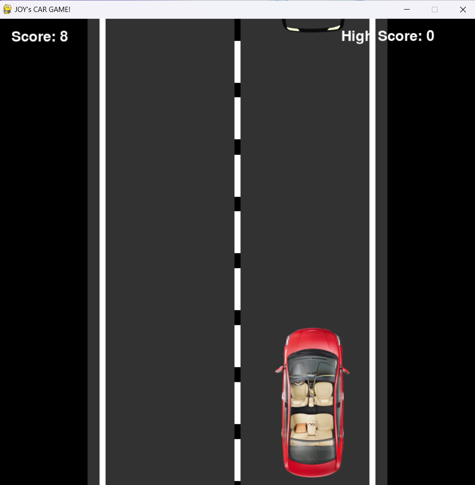

# 🚗 JOY's Car Game 🏁

Welcome to **JOY's Car Game**, a thrilling 2D racing game built with Python and Pygame! 🚗💨 Your mission: Dodge traffic, speed up, and aim for the highest score while cruising down the road. The challenge? The longer you survive, the faster the game gets! ⚡



## ✨ Features

- 🏎️ Smooth car movement with intuitive controls
- 🚧 Randomly generated enemy cars to avoid
- 🌟 Increasing speed and difficulty as you progress
- 🎶 Background music and sound effects for a dynamic experience
- 🏆 Real-time score and high-score tracking
- 💥 Game Over screen with an option to replay

## 🎮 Controls

- **⬅️ Left Arrow or A Key**: Move to the left lane
- **➡️ Right Arrow or D Key**: Move to the right lane
- **⬆️ Up Arrow or W Key**: Increase speed
- **Escape Key (Esc)**: Quit the game

## 🛠️ Installation & Setup

### Requirements

- Python 3.x
- Pygame library

To install Pygame, simply run:

```bash
pip install pygame
